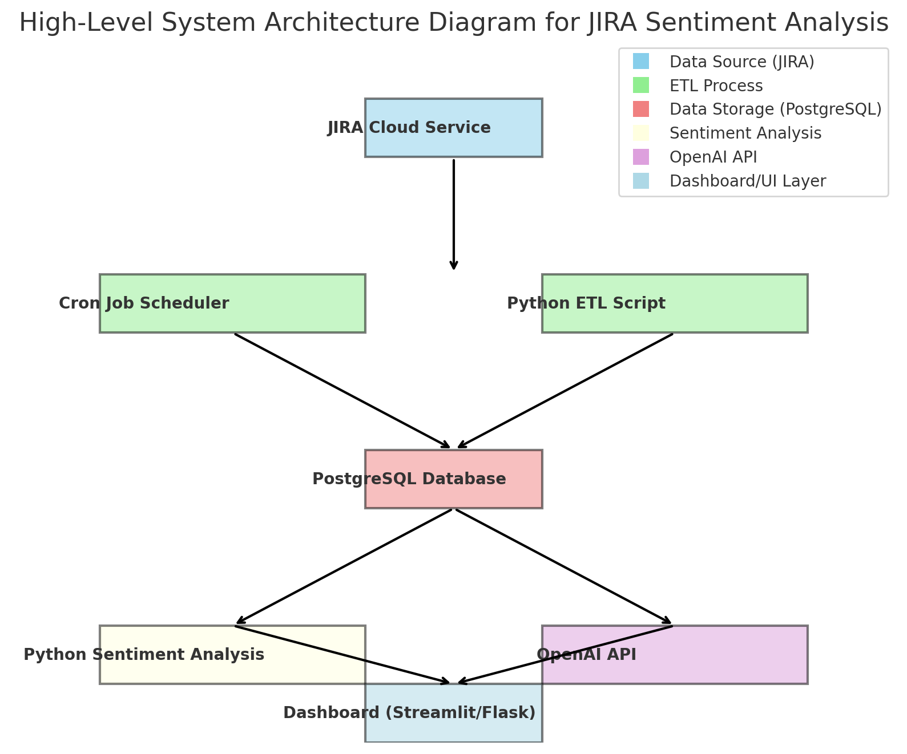

Workflow Overview

1. Data Fetching:

	•	Use a cron job to periodically fetch JIRA tickets and comments.
	•	Store them in a local PostgreSQL database.

2. Data Storage:

	•	Design a schema in PostgreSQL to store tickets and comments effectively.
	•	Ensure indexing for efficient querying.

3. Data Processing:

	•	Use OpenAI’s API to perform sentiment analysis on comments.
	•	Store the analysis results back in PostgreSQL for easy retrieval and further analysis.

4. Visualization/Reporting (Optional):

	•	Build a dashboard using tools like Streamlit, Flask, or any BI tool to display results.

